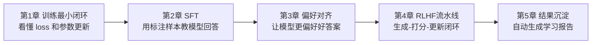
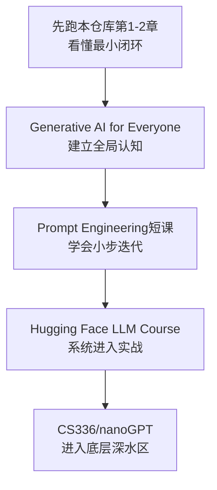

# 大模型训练零基础入门（给 Java 后端同学）

你现在不需要先懂 AI、也不需要先懂 Python。
这份文档的目标只有一个：让你先建立“训练到底在做什么”的直觉。

## 1. 先用一句话理解“训练”

训练就是：
给模型很多“输入 -> 正确输出”的例子，
让模型不断调整内部参数，
让它下次更可能给出你想要的答案。

你可以把它理解为：
一个新人同事一开始回答很差，
你不断给他示例和反馈，
他逐渐学会“在类似场景下怎么回答更好”。

## 2. 5 章到底在学什么（先看图）



## 3. 每章你只要抓住一个核心

- 第 1 章：模型会“越练越准”，你要看到 `loss` 下降。
- 第 2 章：模型学会“输入问题 -> 输出建议”。
- 第 3 章：模型学会“更偏好好答案，少选差答案”。
- 第 4 章：把“生成、评分、更新”串起来。
- 第 5 章：把实验结果整理成可复盘报告。

## 4. 你现在怎么学（极简流程）

1. 先运行第 1 章脚本，只看 loss 下降。
2. 再运行第 2 章脚本，只看“输入->输出”是否符合直觉。
3. 再运行第 3 章，比较好/坏候选被偏好的趋势。
4. 再运行第 4 章，看“高奖励策略概率变高”。
5. 最后运行第 5 章，产出报告。

## 5. 命令清单（复制即可）

```bash
python3 projects/project-00-foundation/toy_autograd_train.py
python3 projects/project-01-sft/train.py
python3 projects/project-02-preference-alignment/dpo_train.py
python3 projects/project-02-preference-alignment/grpo_train.py
python3 projects/project-03-rlhf-pipeline/rlhf_pipeline_demo.py
python3 projects/project-04-capstone/build_learning_report.py
```

## 6. 你会看到什么现象（这就是成功信号）

- 第 1 章：`loss` 从大到小，说明模型在学习。
- 第 2 章：不同输入会映射到不同建议，说明“监督学习”有效。
- 第 3 章：`margin` 逐步变大，说明模型偏好好答案。
- 第 4 章：平均期望奖励变高，说明策略在优化。
- 第 5 章：输出 `learning_report.md`，说明实验沉淀完成。

## 7. 你暂时可以忽略的词

刚开始你可以先不深究这些词：
`梯度`、`交叉熵`、`策略梯度`、`优势函数`。

你只要先记住：
- 有一个“好坏指标”（loss/奖励）
- 模型每轮根据这个指标微调参数
- 指标朝正确方向变化，就说明你在进步

## 8. 外部课程怎么接（防止你看了又看不懂）



推荐链接（按顺序）：

1. https://www.deeplearning.ai/courses/generative-ai-for-everyone/
2. https://www.deeplearning.ai/short-courses/chatgpt-prompt-engineering-for-developers/
3. https://huggingface.co/learn/llm-course/en/chapter1/1
4. https://www.coursera.org/learn/generative-ai-with-llms
5. https://cs336.stanford.edu/

如果你现在看第 3、4、5 条仍然吃力，这是正常的。
先把本仓库第 1、2 章反复跑通，再进入它们。
