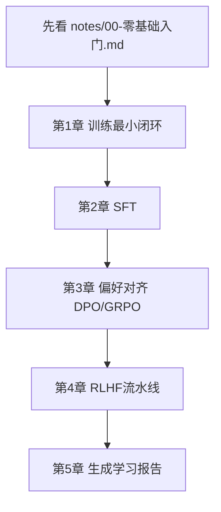

# 章节代码索引（超简版）

如果你是零基础，请按顺序执行，不要跳章。



## 第 1 章：训练基础

- 代码：`projects/project-00-foundation/toy_autograd_train.py`
- 讲义：`projects/project-00-foundation/GUIDE_STEP_BY_STEP.md`
- 目标：看懂 loss 为什么会下降

## 第 2 章：SFT（监督微调）

- 代码：`projects/project-01-sft/train.py`
- 讲义：`projects/project-01-sft/GUIDE_STEP_BY_STEP.md`
- 目标：看懂“输入问题 -> 输出建议”的学习过程

## 第 3 章：偏好对齐

- 代码：`projects/project-02-preference-alignment/dpo_train.py`
- 代码：`projects/project-02-preference-alignment/grpo_train.py`
- 讲义（DPO）：`projects/project-02-preference-alignment/GUIDE_STEP_BY_STEP_DPO.md`
- 讲义（GRPO）：`projects/project-02-preference-alignment/GUIDE_STEP_BY_STEP_GRPO.md`
- 目标：看懂模型如何更偏好“好答案”

## 第 4 章：RLHF 流水线

- 代码：`projects/project-03-rlhf-pipeline/rlhf_pipeline_demo.py`
- 讲义：`projects/project-03-rlhf-pipeline/GUIDE_STEP_BY_STEP.md`
- 目标：看懂“生成 -> 打分 -> 更新”的完整闭环

## 第 5 章：学习成果沉淀

- 代码：`projects/project-04-capstone/build_learning_report.py`
- 讲义：`projects/project-04-capstone/GUIDE_STEP_BY_STEP.md`
- 目标：自动生成实验报告，形成可复盘产物

## 一键运行

```bash
python3 projects/project-00-foundation/toy_autograd_train.py
python3 projects/project-01-sft/train.py
python3 projects/project-02-preference-alignment/dpo_train.py
python3 projects/project-02-preference-alignment/grpo_train.py
python3 projects/project-03-rlhf-pipeline/rlhf_pipeline_demo.py
python3 projects/project-04-capstone/build_learning_report.py
```

## Notebook 入口

- `notebooks/ch01_foundation.ipynb`
- `notebooks/ch02_sft.ipynb`
- `notebooks/ch03_preference_alignment.ipynb`
- `notebooks/ch04_rlhf_pipeline.ipynb`
- `notebooks/ch05_capstone_report.ipynb`
