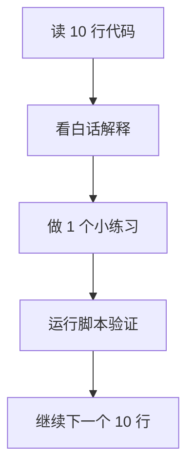

# 第 1 章讲义模式：10 行一讲（零基础）

使用方式：
1. 左边打开 `toy_autograd_train.py`。
2. 按本文每个“行号区间”阅读。
3. 每看完一段，做一个小练习再继续。

## 代码总图（先有全局感）

## 第 1 段（第 1-10 行）

白话解释：
- 这几行是在告诉你“这个脚本是干什么的”。
- 重点是 4 步：预测、算误差、算梯度、更新参数。
- 你现在不用理解公式，只要记住这是一个反复纠错的过程。

动手练习：
- 把第 5 行“4 步”改成你自己的话（比如“猜答案、看错多少、想怎么改、真的去改”）。

## 第 2 段（第 11-20 行）

白话解释：
- 这里是 Java 类比 + 导入库。
- `random` 用来造训练数据。
- `dataclass` 用来简化“类定义”。

动手练习：
- 说出 `random` 和 `dataclass` 各干什么。
- 不需要写代码，只要口头能讲清楚就行。

## 第 3 段（第 21-30 行）

白话解释：
- 定义了 `LinearModel`，它就是模型本体。
- 模型只有两个参数：`w` 和 `b`。
- 公式是 `y = w*x + b`。

动手练习：
- 你手算一下：如果 `w=2`、`b=1`、`x=3`，结果是多少？

## 第 4 段（第 31-40 行）

白话解释：
- 这段定义了 `predict`（预测）函数和 `make_dataset`（造数据）函数开头。
- `predict` 非常关键：训练时会反复调用它。

动手练习：
- 在纸上写出 `predict(5)` 的计算过程（继续用 `w=2,b=1` 举例）。

## 第 5 段（第 41-50 行）

白话解释：
- 这里说明数据是按“真实规律 + 少量噪声”生成的。
- `random.seed(42)` 的作用是：每次运行都一样，便于你学习和排错。

动手练习：
- 把 `seed` 改成 `7`，运行一次，观察输出和原来是否不同。

## 第 6 段（第 51-60 行）

白话解释：
- 这段在循环里不断生成 `(x, y)` 样本。
- 最后返回整个数据集。
- 第 60 行开始是训练函数 `train(...)`，这是全章核心。

动手练习：
- 把 `n` 从 `80` 改成 `20`，看看训练是否还会收敛（loss 是否仍下降）。

## 第 7 段（第 61-70 行）

白话解释：
- 这段是训练函数说明文字，告诉你参数和目标。
- 你现在只要理解：`loss` 是“错得有多严重”的指标。

动手练习：
- 用自己的话解释什么叫“loss 越小越好”。

## 第 8 段（第 71-80 行）

白话解释：
- 第 75 行是总训练轮次循环。
- 第 77~79 行每轮都先把梯度和损失清零。
- 这跟你写批处理每轮初始化变量是一样的。

动手练习：
- 把 `epochs` 改成 `20`，看打印行数和最终效果有什么变化。

## 第 9 段（第 81-90 行）

白话解释：
- 进入每条样本循环。
- 第 83 行做预测；84 行算误差。
- 第 87、90 行在累计损失和梯度。

动手练习：
- 在第 84 行后面临时加 `print(err)`，只运行 1 个 epoch 看看误差正负是怎样变化的。

## 第 10 段（第 91-100 行）

白话解释：
- 91 行继续累计 `b` 的梯度。
- 94~96 行做“平均化”。
- 100 行是最关键更新：`w = w - lr * grad_w`。

动手练习：
- 把 `lr` 从 `0.03` 改成 `0.3`，观察会不会震荡或不稳定。

## 第 11 段（第 101-110 行）

白话解释：
- 101 行更新 `b`。
- 104~105 行控制日志打印频率。
- 108 行开始进入 `main()` 主函数。

动手练习：
- 把“每 20 轮打印”改成“每 10 轮打印”，观察 loss 曲线更细节的变化。

## 第 12 段（第 111-120 行）

白话解释：
- 111 行生成数据。
- 114 行把模型参数初始化为 0。
- 117 行正式训练。
- 120 行准备做测试。

动手练习：
- 把初始化改成 `w=10,b=10`，再跑一次，看还能不能慢慢收敛。

## 第 13 段（第 121-126 行）

白话解释：
- 121 行做单点预测。
- 122 行打印最终结果。
- 125~126 行是 Python 程序入口（相当于 Java 的 main 触发）。

动手练习：
- 把 `test_x` 改成 `10.0`，手算期望值，再对比程序输出。

## 这一章过关标准（你达成 3 条就算过关）

1. 你能解释 `loss` 为什么会下降。
2. 你知道 `learning_rate` 太大可能不稳定。
3. 你能说清 `w,b` 在训练中是如何更新的。
4. 你能改一处参数并预测输出变化趋势。

## 下一步

- 过关后进入第 2 章：`projects/project-01-sft/train.py`。
- 进入前先回答自己一个问题：
  “第 1 章里，模型是怎么从错误中学习的？”
