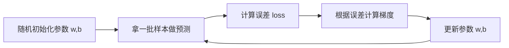

# 第 1 章：训练基础（先把这一章看懂）

## 一句话目标

你只要看懂一件事：
模型参数会在每轮训练后更新，`loss` 会越来越小。

## 先看图



## 运行方式

```bash
python3 projects/project-00-foundation/toy_autograd_train.py
```

## 运行后重点看什么

- 看每轮打印的 `loss` 是否整体下降。
- 看 `w` 是否逐渐接近 2，`b` 是否逐渐接近 1。
- 最后 `x=3` 时预测值是否接近 7。

## Java 对照理解

- `LinearModel`：可类比一个有字段的 Java 类。
- `train(...)`：可类比你写的批处理循环。
- `loss`：可类比监控指标，越低越好。

## 卡住时先看哪几行

- `for epoch in range(...)`：训练总循环。
- `err = pred - y`：误差。
- `model.w -= lr * grad_w`：参数更新核心。

## 讲义模式（零基础推荐）

- `projects/project-00-foundation/GUIDE_STEP_BY_STEP.md`
- 按每 10 行代码阅读：白话解释 + 动手练习
