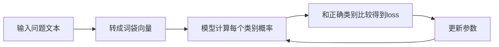

# 第 2 章：SFT（监督微调）

## 一句话目标

让模型学会：
“看到某类问题，就给出对应风格的回答”。

## 先看图



## 运行方式

```bash
python3 projects/project-01-sft/train.py
```

## 运行后重点看什么

- `平均loss` 逐步下降，说明模型学到了映射关系。
- `预测结果` 中，输入问题会落到不同类别。
- 每个类别会映射到一个预设的响应模板。

## Java 对照理解

- `DATASET`：可类比样本表。
- `weights`：可类比参数矩阵 `double[][]`。
- `predict(...)`：可类比线上推理接口逻辑。

## 卡住时先看哪几块

- `tokenize` + `featurize`：文本如何变成数字。
- `softmax`：如何把打分变成概率。
- `weights[c][i] -= ...`：参数如何更新。

## 讲义模式（零基础推荐）

- `projects/project-01-sft/GUIDE_STEP_BY_STEP.md`
- 按“10 行一讲”阅读：白话解释 + 动手练习
