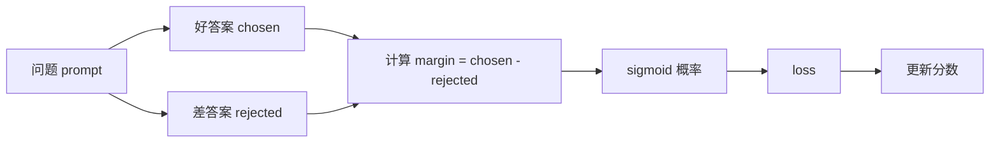

# 第 3 章讲义模式（DPO）：10 行一讲

配合文件：`projects/project-02-preference-alignment/dpo_train.py`

## 第 1 段（1-10 行）

白话解释：
- 文件说明了 DPO 的核心目标：拉大好答案和差答案的分差。

练习：
- 你用一句话解释“为什么要拉大分差”。

## 第 2 段（11-22 行）

白话解释：
- 定义样本结构 `PairSample`，一条样本就有 prompt/chosen/rejected。

练习：
- 口头说出 chosen 与 rejected 的区别。

## 第 3 段（29-33 行）

白话解释：
- 3 条偏好样本，都是“同一问题的好/差回答对比”。

练习：
- 自己新增一条样本，再运行观察结果。

## 第 4 段（36-39 行）

白话解释：
- `sigmoid` 把分差转成 0~1 概率。
- 分差越大，概率越接近 1。

练习：
- 手算：若 margin=0，sigmoid 大约是多少？

## 第 5 段（42-54 行）

白话解释：
- 初始化训练超参数和 `scores` 字典。
- 每个回答起始分数都设为 0。

练习：
- 把 `epochs` 改成 `20`，看训练是否还明显改善。

## 第 6 段（55-70 行）

白话解释：
- 核心训练内循环：拿当前分数算 margin -> 算 p -> 算 loss。
- `loss` 越小表示偏好越明确。

练习：
- 临时打印 `margin`，观察它是否逐步增大。

## 第 7 段（72-78 行）

白话解释：
- 根据梯度更新：chosen 分数上调、rejected 分数下调。
- 这一步就是“偏好学习”。

练习：
- 把 `lr` 改成 `0.05` 和 `0.8` 各跑一次，对比稳定性。

## 第 8 段（80-86 行）

白话解释：
- 打印最终每条样本的 margin。
- 只要 margin 明显为正，说明“更偏好好答案”。

练习：
- 删除一条训练样本，看剩余样本 margin 是否仍上升。

## 第 9 段（89-90 行）

白话解释：
- Python 入口，和 Java main 的触发作用类似。

练习：
- 你自己解释 `if __name__ == "__main__"` 的作用。

## 过关标准

1. 你能解释 margin 的业务含义。
2. 你能解释为什么 chosen/rejected 要成对出现。
3. 你能通过改学习率观察收敛差异。
