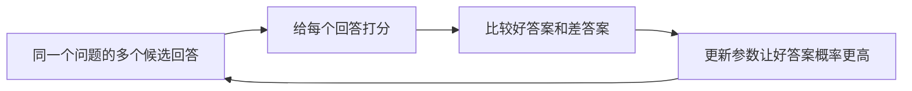

# 第 3 章：偏好对齐（DPO / GRPO）

## 一句话目标

模型不只要“能答”，还要“更倾向答得好”。

## 先看图



## 运行方式

```bash
python3 projects/project-02-preference-alignment/dpo_train.py
python3 projects/project-02-preference-alignment/grpo_train.py
```

## 你可以这样理解 DPO

- 每条样本有 `chosen`（更好）和 `rejected`（更差）。
- 训练目标：拉大 `chosen_score - rejected_score`。
- 看到 `margin` 变大，就是在朝正确方向走。

## 你可以这样理解 GRPO

- 一个问题会有多个候选回答。
- 比较每个回答相对“组平均”的优势值 `advantage`。
- 优势高的回答概率会上升。

## Java 对照理解

- `scores: dict[str, float]`：约等于 `Map<String, Double>`。
- `margin`：可类比排序系统里的分差。
- `advantage`：可类比 `(当前分 - 组均分)`。

## 讲义模式（零基础推荐）

- DPO：`projects/project-02-preference-alignment/GUIDE_STEP_BY_STEP_DPO.md`
- GRPO：`projects/project-02-preference-alignment/GUIDE_STEP_BY_STEP_GRPO.md`
- 按“10 行一讲”阅读：白话解释 + 动手练习
