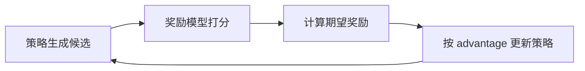

# 第 4 章讲义模式：RLHF 流水线（10 行一讲）

配合文件：`projects/project-03-rlhf-pipeline/rlhf_pipeline_demo.py`

## 第 1 段（1-10 行）

白话解释：
- 这段定义了 RLHF 的 3 步循环。

练习：
- 用一句话复述这 3 步。

## 第 2 段（12-24 行）

白话解释：
- 定义 `PromptCase`，表示“问题 + 候选回答”。

练习：
- 新增一个 `PromptCase`（你熟悉的线上场景）。

## 第 3 段（26-30 行）

白话解释：
- 3 条问题，每条有 2 个候选策略。

练习：
- 把其中一个“差策略”改成更合理的内容，观察后续影响。

## 第 4 段（33-50 行）

白话解释：
- `reward_model` 用关键词规则模拟奖励模型。
- 真实工程里会替换成训练模型。

练习：
- 在 `good_keywords` 中新增一个词（如“限流”），观察奖励变化。

## 第 5 段（53-59 行）

白话解释：
- `softmax` 把候选的 logits 变成概率分布。

练习：
- 临时打印 `probs`，验证总和是否为 1。

## 第 6 段（62-70 行）

白话解释：
- 初始化训练超参数和 logits。
- 每个问题都从“中立概率”开始。

练习：
- 把 `epochs` 改成 `10` 和 `100`，对比最终收敛程度。

## 第 7 段（72-84 行）

白话解释：
- 对每个问题：先评分，再计算当前策略期望奖励。

练习：
- 临时打印 `scores` 和 `expected_reward`，理解每轮发生了什么。

## 第 8 段（86-90 行）

白话解释：
- 用 `advantage = score - baseline` 更新 logits。
- 高于基线的候选被强化。

练习：
- 把 `lr` 从 0.25 改为 0.05，观察学习速度。

## 第 9 段（92-104 行）

白话解释：
- 每 10 轮打印平均期望奖励。
- 最后打印每个问题的最优策略和概率。

练习：
- 观察哪一轮后奖励基本稳定，不再明显提升。

## 第 10 段（107-108 行）

白话解释：
- Python 入口。

练习：
- 解释入口判断为何常见于 Python 脚本。

## 过关标准

1. 你能解释“奖励上升 -> 策略变好”的链路。
2. 你能解释 advantage 的作用。
3. 你能通过改关键词或奖励预判结果方向。
