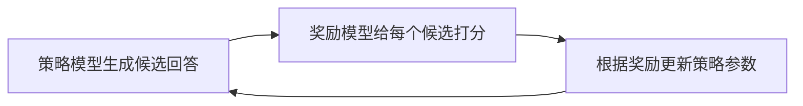

# 第 4 章：RLHF 流水线（最小闭环）

## 一句话目标

把训练流程串起来：生成候选 -> 奖励打分 -> 参数更新。

## 先看图



## 运行方式

```bash
python3 projects/project-03-rlhf-pipeline/rlhf_pipeline_demo.py
```

## 运行后重点看什么

- `平均期望奖励` 是否逐步上升。
- 最终每个问题是否更偏向高奖励策略。

## Java 对照理解

- `reward_model(...)`：可类比评分服务。
- `logits`：可类比每个问题下候选策略的可变状态。
- epoch 循环：可类比离线作业反复迭代。

## 讲义模式（零基础推荐）

- `projects/project-03-rlhf-pipeline/GUIDE_STEP_BY_STEP.md`
- 按“10 行一讲”阅读：白话解释 + 动手练习
