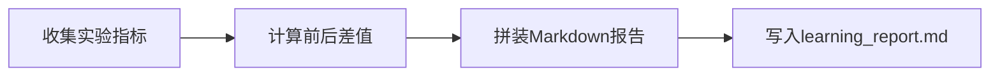

# 第 5 章：学习成果沉淀

## 一句话目标

把训练数据和结果自动整理成报告，方便复盘和分享。

## 先看图



## 运行方式

```bash
python3 projects/project-04-capstone/build_learning_report.py
```

## 输出文件

- `projects/project-04-capstone/learning_report.md`

## Java 对照理解

- `Experiment`：可类比 DTO。
- `to_markdown(...)`：可类比报告组装服务。
- 写文件：可类比导出报表任务。

## 讲义模式（零基础推荐）

- `projects/project-04-capstone/GUIDE_STEP_BY_STEP.md`
- 按“10 行一讲”阅读：白话解释 + 动手练习
